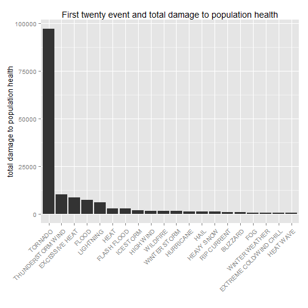
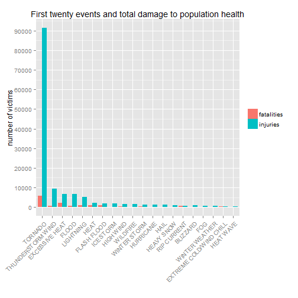

## Synopsis

Storms and other severe weather events can cause both public health and economic problems for communities and municipalities. Many severe events can result in fatalities, injuries, and property damage, and preventing such outcomes to the extent possible is a key concern.
In this work we aim to show which types of events are most harmful with respect to population health and which types of events have the greatest economic consequences in United States. To make this work we obteined data from the U.S. National Oceanic and Atmospheric Administration's (NOAA) storm database. This database tracks characteristics of major storms and weather events in the United States, including when and where they occur, as well as estimates of any fatalities, injuries, and property damage.We specifically work with data for the years from 1950 to 2011. We found that,the event type "tornado" is the most harmful with respect to population helt and also have great economic consequenses but the event type that have the greatest economic consequences is "Flood".

### Libraries

To carry out the data analyses we used the following libraries.

```r
library("knitr")
library("plyr")
library("ggplot2")
library("lubridate")
library("stringr")
source("R code/dataProcessing.R")
```
### Loading and Processing the Raw Data

We first read the data from the raw csv file included in the zip archive. The data come in the form of a comma-separate
d-value.

```r
stormDataRaw<-read.csv("Data/repdata-data-StormData.csv")
```

After reading we check the dimension of data set, the internal structure of data set and the first rows in this data set.

```r
dim(stormDataRaw)
```

```
## [1] 902297     37
```


```r
str(stormDataRaw)
```

```
## 'data.frame':	902297 obs. of  37 variables:
##  $ STATE__   : num  1 1 1 1 1 1 1 1 1 1 ...
##  $ BGN_DATE  : Factor w/ 16335 levels "1/1/1966 0:00:00",..: 6523 6523 4242 11116 2224 2224 2260 383 3980 3980 ...
##  $ BGN_TIME  : Factor w/ 3608 levels "00:00:00 AM",..: 272 287 2705 1683 2584 3186 242 1683 3186 3186 ...
##  $ TIME_ZONE : Factor w/ 22 levels "ADT","AKS","AST",..: 7 7 7 7 7 7 7 7 7 7 ...
##  $ COUNTY    : num  97 3 57 89 43 77 9 123 125 57 ...
##  $ COUNTYNAME: Factor w/ 29601 levels "","5NM E OF MACKINAC BRIDGE TO PRESQUE ISLE LT MI",..: 13513 1873 4598 10592 4372 10094 1973 23873 24418 4598 ...
##  $ STATE     : Factor w/ 72 levels "AK","AL","AM",..: 2 2 2 2 2 2 2 2 2 2 ...
##  $ EVTYPE    : Factor w/ 985 levels "   HIGH SURF ADVISORY",..: 834 834 834 834 834 834 834 834 834 834 ...
##  $ BGN_RANGE : num  0 0 0 0 0 0 0 0 0 0 ...
##  $ BGN_AZI   : Factor w/ 35 levels "","  N"," NW",..: 1 1 1 1 1 1 1 1 1 1 ...
##  $ BGN_LOCATI: Factor w/ 54429 levels "","- 1 N Albion",..: 1 1 1 1 1 1 1 1 1 1 ...
##  $ END_DATE  : Factor w/ 6663 levels "","1/1/1993 0:00:00",..: 1 1 1 1 1 1 1 1 1 1 ...
##  $ END_TIME  : Factor w/ 3647 levels ""," 0900CST",..: 1 1 1 1 1 1 1 1 1 1 ...
##  $ COUNTY_END: num  0 0 0 0 0 0 0 0 0 0 ...
##  $ COUNTYENDN: logi  NA NA NA NA NA NA ...
##  $ END_RANGE : num  0 0 0 0 0 0 0 0 0 0 ...
##  $ END_AZI   : Factor w/ 24 levels "","E","ENE","ESE",..: 1 1 1 1 1 1 1 1 1 1 ...
##  $ END_LOCATI: Factor w/ 34506 levels "","- .5 NNW",..: 1 1 1 1 1 1 1 1 1 1 ...
##  $ LENGTH    : num  14 2 0.1 0 0 1.5 1.5 0 3.3 2.3 ...
##  $ WIDTH     : num  100 150 123 100 150 177 33 33 100 100 ...
##  $ F         : int  3 2 2 2 2 2 2 1 3 3 ...
##  $ MAG       : num  0 0 0 0 0 0 0 0 0 0 ...
##  $ FATALITIES: num  0 0 0 0 0 0 0 0 1 0 ...
##  $ INJURIES  : num  15 0 2 2 2 6 1 0 14 0 ...
##  $ PROPDMG   : num  25 2.5 25 2.5 2.5 2.5 2.5 2.5 25 25 ...
##  $ PROPDMGEXP: Factor w/ 19 levels "","-","?","+",..: 17 17 17 17 17 17 17 17 17 17 ...
##  $ CROPDMG   : num  0 0 0 0 0 0 0 0 0 0 ...
##  $ CROPDMGEXP: Factor w/ 9 levels "","?","0","2",..: 1 1 1 1 1 1 1 1 1 1 ...
##  $ WFO       : Factor w/ 542 levels ""," CI","$AC",..: 1 1 1 1 1 1 1 1 1 1 ...
##  $ STATEOFFIC: Factor w/ 250 levels "","ALABAMA, Central",..: 1 1 1 1 1 1 1 1 1 1 ...
##  $ ZONENAMES : Factor w/ 25112 levels "","                                                                                                                               "| __truncated__,..: 1 1 1 1 1 1 1 1 1 1 ...
##  $ LATITUDE  : num  3040 3042 3340 3458 3412 ...
##  $ LONGITUDE : num  8812 8755 8742 8626 8642 ...
##  $ LATITUDE_E: num  3051 0 0 0 0 ...
##  $ LONGITUDE_: num  8806 0 0 0 0 ...
##  $ REMARKS   : Factor w/ 436774 levels "","-2 at Deer Park\n",..: 1 1 1 1 1 1 1 1 1 1 ...
##  $ REFNUM    : num  1 2 3 4 5 6 7 8 9 10 ...
```


```r
head(stormDataRaw)
```

```
##   STATE__           BGN_DATE BGN_TIME TIME_ZONE COUNTY COUNTYNAME STATE
## 1       1  4/18/1950 0:00:00     0130       CST     97     MOBILE    AL
## 2       1  4/18/1950 0:00:00     0145       CST      3    BALDWIN    AL
## 3       1  2/20/1951 0:00:00     1600       CST     57    FAYETTE    AL
## 4       1   6/8/1951 0:00:00     0900       CST     89    MADISON    AL
## 5       1 11/15/1951 0:00:00     1500       CST     43    CULLMAN    AL
## 6       1 11/15/1951 0:00:00     2000       CST     77 LAUDERDALE    AL
##    EVTYPE BGN_RANGE BGN_AZI BGN_LOCATI END_DATE END_TIME COUNTY_END
## 1 TORNADO         0                                               0
## 2 TORNADO         0                                               0
## 3 TORNADO         0                                               0
## 4 TORNADO         0                                               0
## 5 TORNADO         0                                               0
## 6 TORNADO         0                                               0
##   COUNTYENDN END_RANGE END_AZI END_LOCATI LENGTH WIDTH F MAG FATALITIES
## 1         NA         0                      14.0   100 3   0          0
## 2         NA         0                       2.0   150 2   0          0
## 3         NA         0                       0.1   123 2   0          0
## 4         NA         0                       0.0   100 2   0          0
## 5         NA         0                       0.0   150 2   0          0
## 6         NA         0                       1.5   177 2   0          0
##   INJURIES PROPDMG PROPDMGEXP CROPDMG CROPDMGEXP WFO STATEOFFIC ZONENAMES
## 1       15    25.0          K       0                                    
## 2        0     2.5          K       0                                    
## 3        2    25.0          K       0                                    
## 4        2     2.5          K       0                                    
## 5        2     2.5          K       0                                    
## 6        6     2.5          K       0                                    
##   LATITUDE LONGITUDE LATITUDE_E LONGITUDE_ REMARKS REFNUM
## 1     3040      8812       3051       8806              1
## 2     3042      8755          0          0              2
## 3     3340      8742          0          0              3
## 4     3458      8626          0          0              4
## 5     3412      8642          0          0              5
## 6     3450      8748          0          0              6
```

To achieve our goal we select only six variables that are describe below. This information was obteind from National Weather Service Storm Data Documentation and National Climatic Data Center Storm Events FAQ.

| Varible   |Meaning| 
|---        |---    |
| EVTYPE    | weather events  |
| FATALITIES| count of fatalities caused for the weather events |
| INJURIES  | count of injuries caused for the weather events |
| PROPDMG   | damage monetary estimates caused for the weather events in properties |
| PROPDMGEXP| alphabetical character signifying the magnitude of the number in PROPDMG variable |
| CROPDMG   | damage monetary estimates caused for the weather events in crop  |
| CROPDMGEXP| alphabetical character signifying the magnitude of the number in PROPDMG variable  |

Before begin with the data analisis, we processed the data to get analytic data. In this step we carried out the following activities:

* Cleaning the EVTYPE variable.
* Creation the new PropExp variable.
* Creation the new CropExp variable.


```r
dataProcessing<-function(stormData){
    #Cleaning the EVTYPE variable.
    stormData$EVTYPE<-toupper(stormData$EVTYPE)
    stormData$EVTYPE<-str_trim(stormData$EVTYPE, side = "both")
    stormData$EVTYPE<-gsub(pattern = "TSTM",replacement ="THUNDERSTORM",x =stormData$EVTYPE ) 
    stormData$EVTYPE<-gsub(pattern = "\\(.+?\\)",replacement = "", x = stormData$EVTYPE)
    stormData$EVTYPE<-gsub(pattern = "[0-9]",replacement = "", x = stormData$EVTYPE)
    stormData$EVTYPE<-gsub(pattern = ".",replacement = "", x = stormData$EVTYPE,fixed = T)
    stormData$EVTYPE<-gsub(pattern = ":",replacement = "", x = stormData$EVTYPE,fixed = T)
    stormData$EVTYPE<-gsub(pattern = "-",replacement = "", x = stormData$EVTYPE,fixed = T)
    stormData$EVTYPE<-gsub(pattern = "\\(|\\)",replacement = "", x = stormData$EVTYPE)
    stormData$EVTYPE[grep(pattern = "^THUN", stormData$EVTYPE)]<-"THUNDERSTORM WIND"
    stormData$EVTYPE[grep(pattern = "^HURRICANE", stormData$EVTYPE)]<-"HURRICANE"
    stormData$EVTYPE[grep(pattern = "^FLASH FLO", stormData$EVTYPE)]<-"FLASH FLOOD"
    stormData$EVTYPE[grep(pattern = "^FLOOD", stormData$EVTYPE)]<-"FLOOD"
    stormData$EVTYPE[grep(pattern = "^TORN", stormData$EVTYPE)]<-"TORNADO"
    stormData$EVTYPE[grep(pattern = "^HEAVY RA", stormData$EVTYPE)]<-"HEAVY RAIN"
    stormData$EVTYPE[grep(pattern = "^HEAVY SN", stormData$EVTYPE)]<-"HEAVY SNOW"
    stormData$EVTYPE[grep(pattern = "^HIGH WI", stormData$EVTYPE)]<-"HIGH WIND"
    stormData$EVTYPE[grep(pattern = "^BEACH ERO", stormData$EVTYPE)]<-"BEACH EROSION"
    stormData$EVTYPE[grep(pattern = "^AVALAN", stormData$EVTYPE)]<-"AVALANCHE"
    stormData$EVTYPE[grep(pattern = "^BITTER WIND CHILL", stormData$EVTYPE)]<-"BITTER WIND CHILL"
    stormData$EVTYPE[grep(pattern = "^BLIZZARD", stormData$EVTYPE)]<-"BLIZZARD"
    stormData$EVTYPE[grep(pattern = "^EXTREME WIND", stormData$EVTYPE)]<-"EXTREME WIND"
    stormData$EVTYPE[grep(pattern = "^FREEZING RAIN", stormData$EVTYPE)]<-"FREEZING RAIN"
    stormData$EVTYPE[grep(pattern = "^FUNNEL", stormData$EVTYPE)]<-"FUNNEL CLOUD"
    stormData$EVTYPE[grep(pattern = "^BLOWING SNOW", stormData$EVTYPE)]<-"BLOWING SNOW"
    stormData$EVTYPE[grep(pattern = "^LIGHTNING", stormData$EVTYPE)]<-"LIGHTNING"
    stormData$EVTYPE[grep(pattern = "^RIP CURRENT", stormData$EVTYPE)]<-"RIP CURRENT"
    stormData$EVTYPE[grep(pattern = "^EXTREME COLD", stormData$EVTYPE)]<-"EXTREME COLD/WIND CHILL"
    stormData$EVTYPE[grep(pattern = "^EXTREME HEAT", stormData$EVTYPE)]<-"EXCESSIVE HEAT"
    stormData$EVTYPE[grep(pattern = "^WILD/FOREST FIRE", stormData$EVTYPE)]<-"WILDFIRE"
    stormData$EVTYPE[grep(pattern = "^COASTAL FL", stormData$EVTYPE)]<-"COASTAL FLOOD"
    stormData$EVTYPE[grep(pattern = "^COLD/WIND", stormData$EVTYPE)]<-"COLD/WIND CHILL"
    stormData$EVTYPE[grep(pattern = "^DRY MI", stormData$EVTYPE)]<-"DRY MICROBURST"
    stormData$EVTYPE[grep(pattern = "^DUST STORM", stormData$EVTYPE)]<-"DUST STORM"
    stormData$EVTYPE[grep(pattern = "^EXTREME WIND", stormData$EVTYPE)]<-"EXTREME COLD/WIND CHILL"
    stormData$EVTYPE[grep(pattern = "^FOREST FIRES", stormData$EVTYPE)]<-"WILDFIRE"
    stormData$EVTYPE[grep(pattern = "^WINTER STO", stormData$EVTYPE)]<-"WINTER STORM"
    stormData$EVTYPE[grep(pattern = "^WINTER WEAT", stormData$EVTYPE)]<-"WINTER WEATHER"
    stormData$EVTYPE[grep(pattern = "^TROPICAL STORM", stormData$EVTYPE)]<-"TROPICAL STORM"
    stormData$EVTYPE[grep(pattern = "^WATERS", stormData$EVTYPE)]<-"WATERSPOUT"
    stormData$EVTYPE[grep(pattern = "^GUSTY WI", stormData$EVTYPE)]<-"GUSTY WIND"
    stormData$EVTYPE[grep(pattern = "^WILD", stormData$EVTYPE)]<-"WILDFIRE"
 
    #Creation the new PropExp variable.
    stormData$PropExp[stormData$PROPDMGEXP=="" | stormData$PROPDMGEXP=="?" |stormData$PROPDMGEXP=="-"|stormData$PROPDMGEXP=="+"|stormData$PROPDMGEXP=="0" ]=10^0
    stormData$PropExp[stormData$PROPDMGEXP=="1" ]=10^1
    stormData$PropExp[stormData$PROPDMGEXP=="2" |stormData$PROPDMGEXP=="h"|stormData$PROPDMGEXP=="H"]=10^2
    stormData$PropExp[stormData$PROPDMGEXP=="3"|stormData$PROPDMGEXP=="K" ]=10^3
    stormData$PropExp[stormData$PROPDMGEXP=="4" ]=10^4
    stormData$PropExp[stormData$PROPDMGEXP=="5" ]=10^5
    stormData$PropExp[stormData$PROPDMGEXP=="6"|stormData$PROPDMGEXP=="m"|stormData$PROPDMGEXP=="M" ]=10^6
    stormData$PropExp[stormData$PROPDMGEXP=="7" ]=10^7
    stormData$PropExp[stormData$PROPDMGEXP=="8" ]=10^8
    stormData$PropExp[stormData$PROPDMGEXP=="B" ]=10^9
    
    #Creation the new CropExp variable.
    stormData$CropExp[stormData$CROPDMGEXP=="" | stormData$CROPDMGEXP=="?" |stormData$CROPDMGEXP=="0" ]=10^0
    stormData$CropExp[stormData$CROPDMGEXP=="2"]=10^2
    stormData$CropExp[stormData$CROPDMGEXP=="k"|stormData$CROPDMGEXP=="K" ]=10^3
    stormData$CropExp[stormData$CROPDMGEXP=="m"|stormData$CROPDMGEXP=="M" ]=10^6
    stormData$CropExp[stormData$CROPDMGEXP=="B" ]=10^9
    
    stormData$YEAR<-year(mdy_hms(as.character(stormData$BGN_DATE)))
    return (stormData[,c("EVTYPE","FATALITIES","INJURIES","PROPDMG","PropExp","CROPDMG","CropExp")])
    
}
```


```r
stormData<-dataProcessing(stormDataRaw)
```

After the data processing we compute the total for injuries, fatalities, property damage and crop damage for each event. Also we compute the total damage to population health adding up injuires and fatalities for each event and the total damage to economy adding up property damage and crop damage for each event.


```r
stormDataHE<-ddply(stormData,.(EVTYPE),summarise,
                   fatalities=sum(FATALITIES),
                   injuries=sum(INJURIES),
                   propDmg=sum(PROPDMG*PropExp),
                   cropDmg=sum(CROPDMG*CropExp)
                   )
stormDataHE$totalHarmfulHealth<-(stormDataHE$fatalities+stormDataHE$injuries)
stormDataHE$totalDmgEconomic<-(stormDataHE$propDmg+stormDataHE$cropDmg)
stormDataHE<-stormDataHE[!(stormDataHE$totalHarmfulHealth==0&stormDataHE$totalDmgEconomic==0),]
```

##Results 
In this section we show the results that we found.

In order to show which types of events are most harmful with respect to population health, we can make a bar plot with the  first twenty event that are more harmful. 


```r
i<-order(stormDataHE$totalHarmfulHealth,decreasing = T )
stormDataHE<-stormDataHE[i,]
top20<-stormDataHE[1:20,]
top20$EVTYPE<- reorder(top20$EVTYPE, top20$totalHarmfulHealth,desc)
bar <- ggplot(top20, aes(y=totalHarmfulHealth)) 
bar + geom_bar(aes(x=EVTYPE),stat ="identity",binwidth=1 ) +labs(title="First twenty event and total damage to population health",y="total damage to population health",x="")+
    theme(axis.text.x = element_text(hjust=1,angle = 45))
```

 

The above figure show us that the "TORNADO" is the most harmful with respect to population health, the difference of damage with respect others event is too big.

Then in order to show which types of events have the greatest economic consequences in United States, we can make a bar plot with the  first twenty event that are more harmful. 


```r
i<-order(stormDataHE$totalDmgEconomic,decreasing = T )
stormDataHE<-stormDataHE[i,]
top20<-stormDataHE[1:20,]
top20$EVTYPE<- reorder(top20$EVTYPE, top20$totalDmgEconomic,desc)
bar <- ggplot(top20, aes(y=totalDmgEconomic)) 
bar + geom_bar(aes(x=EVTYPE),stat ="identity",binwidth=1 ) +labs(title="First twenty event and total damage to economy",y="total damage to economy",x="")+
    theme(axis.text.x = element_text(hjust=1,angle = 45))
```

 

The above figure show us that the "FLOOD" has the greatest economic consequences, follow to "HURRICANE" and "TORNADO", is important highlight that the "TORNADO" produce big damage in the population helth and the economy.
